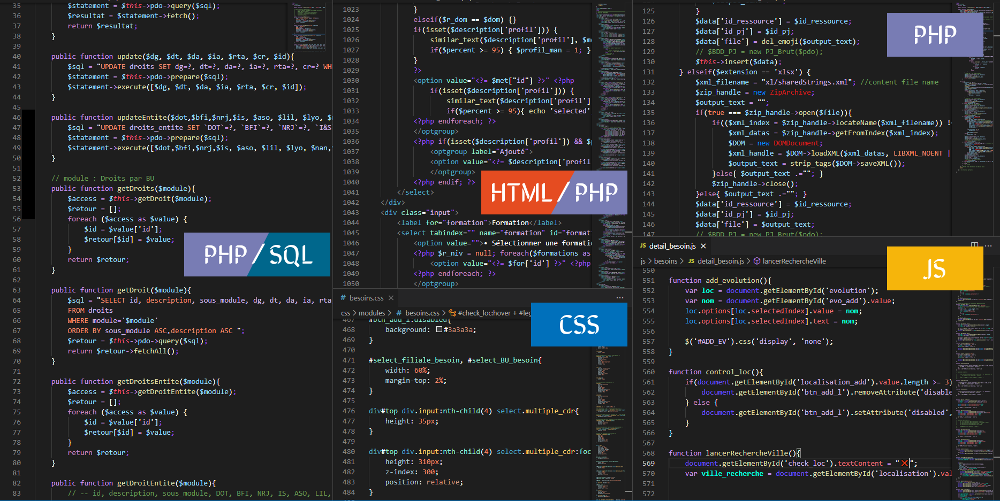
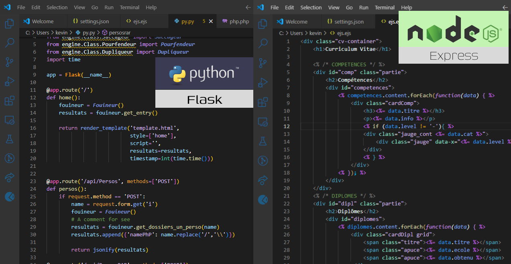

# Kah Rah Theme

## Working with Markdown

Dark theme with slightly vivid colors for a harmonious mixture making it easier to spot each element making up your code.

* Dark base theme
* Enhance differenciation of languages (SQL / PHP / CSS / JS ...)
* Add Python + Flash and Node JS with .ejs files
* Optimize a little
* No more ... :)

## For more information

For more information or for contribute 

▼&emsp;&emsp;▼&emsp;&emsp;▼&emsp;&emsp;▼&emsp;&emsp;▼&emsp;&emsp;▼&emsp;&emsp;▼ 
* [GitHub KahRahTheme](https://github.com/KahlemPik/KahRahTheme)

**Enjoy 😆**

**Any request go to github !**
